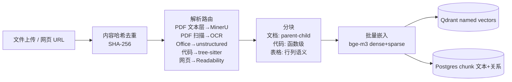
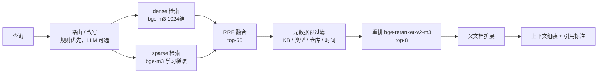

# LocalRAGServer 技术架构设计

> 版本 v2.0 · 2026-08-16（正式批准：Phase 6 七项关键门达成——①安全审计②备份恢复③SLO 压测④故障演练⑤发布回滚⑥灰度替代决策⑦迁移清单；§19-21 为 Phase 4/5 落地章节）
> v2.0-draft 变更：Phase 4/5 落地回填——Web 管理端五模块 + 独立会话认证、structlog 全链路、RAGAS 评测闭环、URL 订阅爬取、压测基线
> v1.3 变更：Phase 2/3 落地回填——混合检索 BM25+RRF 实测 MRR +8.1pp、ACL 强制层、MCP 双 transport、限流本地化 ADR-005、审计管线、探针
> 输入约束：NVIDIA GPU 8~16GB 单机（实机 RTX 2080 Ti 11GB，Turing SM75）· 十万级文档（≈千万级 chunk）· PDF/Office/代码/网页 · 中英混合 · 服务对象为 Agent（MCP + REST）+ 人工管理端（Web）

## 1. 目标与定位

| 维度 | 目标 |
|---|---|
| 服务定位 | 本地部署的 **RAG 基础设施**，非应用：向上对 Agent / 应用暴露检索与生成能力，不绑定具体业务 |
| 接入方式 | MCP 协议（stdio transport 5 工具，v1.0；streamable HTTP 于 v1.1 上线，见 ADR-006）+ OpenAI 兼容 REST + Web 管理端（Phase 4） |
| 规模 | 十万级文档 / 千万级 chunk，单机承载，预留横向扩展路径 |
| 核心能力 | 多格式解析（PDF/Office/代码/网页）、中英混合检索、混合检索+重排、RAG 生成、增量更新、评估闭环 |
| 非目标 | 不追求多模态生成、不内置业务工作流、不替代 Dify 类应用平台 |

## 2. 总体架构

```mermaid
flowchart TB
    subgraph Clients["接入方"]
        A1[Agent<br/>Claude Code / MCP 客户端]
        A2[应用<br/>REST 客户端]
        A3[管理员<br/>Web 管理端]
    end

    subgraph Gateway["接入层"]
        B1[MCP Server<br/>search / ask / ingest]
        B2[FastAPI REST<br/>OpenAI 兼容 + 原生 API]
        B3[Web UI<br/>Vue3 管理端]
        B4[认证与限流<br/>API Key / Redis 令牌桶]
    end

    subgraph Core["服务层"]
        C1[RAG Orchestrator<br/>路由 / 改写 / 上下文组装]
        C2[Hybrid Retrieval<br/>dense + sparse + RRF]
        C3[Reranker<br/>bge-reranker-v2-m3]
        C4[Generator<br/>vLLM Qwen3]
        C5[KB Manager<br/>知识库 / 文档生命周期 / ACL]
    end

    subgraph Data["数据层"]
        D1[(Qdrant<br/>dense+sparse 向量 + 过滤)]
        D2[(PostgreSQL<br/>元数据 / chunk 文本 / 任务状态)]
        D3[(MinIO<br/>原始文件)]
        D4[(Redis<br/>队列 / 缓存 / 限流)]
    end

    subgraph Ingest["摄取管线"]
        E1[解析 Worker<br/>MinerU / PaddleOCR / tree-sitter]
        E2[分块器<br/>文档 / 代码 / 网页策略]
        E3[嵌入 Worker<br/>TEI bge-m3]
        E4[网页爬虫<br/>增量采集]
    end

    subgraph Ops["可观测与评估"]
        F1[Prometheus + Grafana]
        F2[RAGAS 评测闭环]
    end

    A1 --> B1
    A2 --> B2
    A3 --> B3
    B1 & B2 & B3 --> B4 --> C1
    C1 --> C2 --> C3 --> C4
    C1 <--> C5
    C2 <--> D1
    C2 <--> D4
    C5 <--> D2
    E4 --> E1 --> E2 --> E3 --> D1
    E3 --> D2
    E1 <--> D3
    E1 & E2 & E3 <--> D4
    F1 -.-> C2 & C4 & E3
    F2 -.-> C4
```



分层职责：

- **接入层**：三通道（MCP / REST / Web）共享同一服务内核，统一认证、限流、审计
- **服务层**：无状态可横向扩展；检索与生成解耦，可独立调用（Agent 可只检索不自带生成，或走完整 RAG）
- **摄取管线**：异步（Celery），与在线服务隔离，避免大文件解析拖垮查询
- **数据层**：向量（Qdrant）、结构化（Postgres）、文件（MinIO）、状态/缓存（Redis）各司其职

## 3. 技术选型总表

| 环节 | 选型 | 理由 |
|---|---|---|
| 语言/框架 | Python 3.13 + FastAPI + Pydantic v2 | RAG 生态最全；异步高并发；类型安全（v1.1：统一钉 3.13，与 pyproject/实机一致） |
| 任务队列 | Celery + Redis | 解析/嵌入异步化，重试、断点续传、flower 监控 |
| 向量库 | **Qdrant**（单机） | named vectors（dense+sparse 共存）、原生 RRF、payload 过滤；十万级文档运维最简单 |
| 嵌入模型 | **bge-m3**（TEI 托管） | 一个模型同时输出 dense + sparse 向量；100+ 语言（中英混合）；8192 上下文 |
| 重排模型 | **bge-reranker-v2-m3**（TEI 托管） | 多语言 cross-encoder，与嵌入同源同栈 |
| 生成模型 | **Qwen3-8B-AWQ**（vLLM），升级路径 Qwen3-14B-AWQ | 中文能力强、指令跟随好；AWQ 4bit 显存友好 |
| 解析主线 | **MinerU**（PDF 版面/公式/表格→Markdown）+ **PaddleOCR**（扫描件） | 中文文档解析事实标准 |
| 解析兜底 | unstructured / docling | Office（docx/pptx/xlsx）与一般格式 |
| 代码分块 | tree-sitter | 函数/类级 AST 分块，保留符号与 docstring |
| 网页采集 | httpx + Playwright + Readability | 正文提取、sitemap、增量更新 |
| 文件存储 | MinIO | S3 兼容，本地对象存储 |
| 元数据 | PostgreSQL 16 | 文档/知识库/任务状态/会话/API Key |
| MCP | 官方 `mcp` Python SDK | stdio（v1.0）+ streamable HTTP（v1.1 已实现，ADR-006） |
| Web 前端 | Vue 3 + TypeScript + Pinia + Element Plus | 内部管理端，开发效率优先 |
| 可观测 | Prometheus + Grafana + structlog | 指标、链路、结构化日志 |
| 评估 | RAGAS + DeepEval | 忠实度/相关度/上下文精度回归 |

## 4. GPU 显存预算（关键决策）

| 模型 | 用途 | 权重 | 运行时 VRAM | 备注 |
|---|---|---|---|---|
| bge-m3（TEI） | 嵌入 dense+sparse | 1.1GB | ≈2.5GB | 摄取与查询共用 |
| bge-reranker-v2-m3（TEI） | 重排 | 1.1GB | ≈2GB | 可降级 CPU |
| Qwen3-8B-AWQ（vLLM） | 生成 | 5.2GB | ≈6GB | 含 KV cache |
| Qwen3-14B-AWQ（vLLM） | 生成（升级） | 9.3GB | ≈11.5GB | 16GB 卡紧张，需调 KV |

**四档配置策略**（v1.1：修正 C 档数值矛盾，新增实机 Profile D）：

| Profile | 硬件 | 组合 | 显存 |
|---|---|---|---|
| **D（实机默认）** | 11GB（Turing） | 生成走 llama.cpp GGUF Q4_K_M 部分 GPU offload（或 vLLM 钉版 + `--enforce-eager` + max-model-len 8K）+ bge-m3 GPU + reranker CPU | ≈9.5GB ✓（Spike 实测校准） |
| A | ≥12GB | 8B + bge-m3 + reranker 全 GPU 常驻 | ≈10.5GB ✓ |
| B | 16GB | 14B + bge-m3 GPU；reranker 移 CPU | ≈14GB（紧） |
| C | 8GB | bge-m3 GPU + 生成 CPU/部分 offload；**生成与嵌入不可同驻 GPU** | ≈5GB（嵌入）+ 生成 CPU |

原则：**嵌入必须 GPU 常驻**（千万级 chunk 摄取是吞吐关键），reranker 是可降级项，生成模型是显存弹性最大的变量。
**Turing 警示**：SM75 无 flash-attention；vLLM ≥0.24 移除 SM75 FlashInfer 后端（22K 上下文解码吞吐可跌至 ~1 tok/s），**必须钉版本**并先过 Spike 实测（docs/quality.md P0-2），吞吐预期按备选栈分列、禁止 latest 镜像。

## 5. 摄取管线设计



要点：

1. **文档生命周期状态机**：`uploaded → parsed → chunked → embedded → indexed → ready / failed`，每阶段落库，可重试、断点续传（**已实现**，契约 docs/design/ingest-state-machine.md v1.1；Celery 任务链 + 失败恢复 + DLQ 语义）
2. **幂等与增量**：文件内容哈希去重；chunk 哈希变化才重新嵌入；网页按 URL + 抓取时间做增量 upsert，源站删除则清理
3. **parent-child 分块**：子块（≈512 token）用于检索，命中后回填父块（≈2048 token）送入生成，兼顾召回精度与上下文完整
4. **代码专用策略**：按函数/类切分，chunk 头注入 `repo#path#symbol` 与 docstring；支持按仓库过滤
5. **表格策略**：MinerU 转 Markdown 后，表头与每行分别建 chunk 并互挂引用，解决表格检索"表头丢失"问题
6. **批量嵌入**：Worker 攒批（batch 128~256）调 TEI，dense + sparse 一次生成，双向量同时写入 Qdrant

## 6. 检索设计



- **混合检索**：dense 语义召回 + sparse 关键词召回，RRF 分数融合（Qdrant Query API 原生支持，无外部编排）
- **查询处理**：按 KB 类型路由（代码库走符号加权、文档库走语义）；规则型改写（去除语气词、提取实体）默认开启，LLM 改写（多查询、HyDE）作为可选增强，避免每次查询都烧 token
- **过滤优先于融合**：KB id、文档类型、时间范围等标量过滤前置，缩小候选集
- **可检索无生成**：`/api/v1/search` 独立暴露，Agent 可只拿 chunk 自行推理，也可走 `/v1/chat/completions` 完整 RAG
- **可选 GraphRAG（Phase 5）**：LightRAG 模块化接入，实体/关系图独立索引，面向多跳问答；默认关闭

## 7. 生成设计

- **模型**：vLLM 托管 Qwen3-8B-AWQ（OpenAI 兼容接口），16GB 卡可切换 14B
- **提示词策略**：系统提示强制"仅依据给定上下文回答 + 逐条引用 [n]"
- **拒答策略**：重排最高分低于阈值 → 明确回答"知识库中未找到相关内容"而非编造
- **引用格式**：chunk id → 来源文件 → 页码/行号（代码库为 repo#path#symbol），随答案返回结构化 citations 字段，供 Agent 二次利用
- **流式输出**：SSE 逐 token 返回，与 OpenAI 协议一致
- **上下文压缩**：超长文档命中时先做摘要压缩再入提示词（Phase 3 优化项）

## 8. 数据模型与存储规划

### 8.1 PostgreSQL 核心表

| 表 | 关键字段 |
|---|---|
| knowledge_bases | id, name, kb_type(document/code/web), description, created_at |
| documents | id, kb_id, title, source(path/url), content_hash, status, page_count, created_at |
| chunks | id, doc_id, kb_id, parent_id, index, token_count, content, meta(jsonb) |
| ingest_jobs | id, doc_id, stage, status, error, retries, worker_id |
| api_keys | id, name, key_hash, kb_acl, rate_limit, expires_at |
| chat_sessions | id, kb_id, messages, created_at |

### 8.2 Qdrant Collection 设计

- **命名向量**：`dense`（1024 维 float32）+ `sparse`（bge-m3 学习稀疏）
- **Payload 最小化**：只存 `kb_id / doc_id / chunk_id / 类型 / 时间戳` 等过滤字段，**chunk 正文存 Postgres**（避免 Qdrant 膨胀，检索后按 id 回查正文）
- **HNSW**：`m=16, ef_construct=200`；查询 `ef=128~256`

### 8.3 容量估算（千万级 chunk）

| 项 | 估算 |
|---|---|
| dense 向量 | 1024 维 f32 = 4KB × 1000万 ≈ 40GB（含 HNSW 开销 ≈ 55~60GB） |
| sparse 向量 | ≈ 5~15GB |
| 原始文件 | MinIO 2~5TB（视平均文件大小） |
| 元数据 + chunk 正文 | Postgres ≈ 30~80GB |
| 内存 | 64GB 舒适（HNSW 常驻 + page cache），32GB 为下限 |
| 磁盘 | NVMe ≥ 2TB 建议 |

### 8.4 吞吐估算

| 环节 | 估算 |
|---|---|
| 嵌入 | GPU 批处理 ≈ 500~1500 chunk/s → 1000万 chunk ≈ 2~5 小时（模型侧） |
| 解析 | MinerU 1~3 s/页（CPU）→ 数十万页需数天，**解析是真正瓶颈**，须多 Worker 横向扩展、支持分批导入 |
| 在线查询 | 混合检索 + 重排端到端 P95 < 500ms（目标） |
| 生成 | 实测（Spike，见 docs/spike/sm75-matrix.md）：Qwen3-8B Q4_K_M via llama.cpp = **Prompt 74 t/s · 解码 29.7 t/s**；vLLM 钉版口径待 Linux 验证 |
| 摄取（管线开销） | 实测（真实领域 MD ×100）：**2850 文档/小时 · 149.6 chunk/s**（stub 嵌入口径，docs/perf/ingest-bench-20260814.md）；bge-m3 GPU 嵌入 141 条/s（Spike） |
| 深度解析 | MinerU 3.4.5 小文献质量优异（公式/结构/DOI 完整）；**534MB/765 页教材单机 CPU >1.5h 未完成 → 大文档走 pymupdf 快速通道或分批并行 worker**（docs/perf/parsing-eval-20260814.md） |

## 9. API 与 MCP 设计

### 9.1 REST API

统一响应信封（全接口一致）：

```json
{ "success": true, "data": { }, "error": null, "meta": { "total": 10, "page": 1 } }
```

### 9.1 REST API

| 方法 | 路径 | 通道 | 说明 |
|---|---|---|---|
| POST | `/api/v1/kb` | Bearer | 创建知识库（仅主 Key） |
| GET | `/api/v1/kb` | Bearer | 列表（ACL 过滤） |
| GET | `/api/v1/kb/{id}` | Bearer | 知识库详情 |
| POST | `/api/v1/kb/{id}/documents` | Bearer | 上传文档（multipart/form-data） |
| POST | `/api/v1/kb/{id}/documents/url` | Bearer | URL 摄取（异步） |
| GET | `/api/v1/kb/{id}/documents` | Bearer | 文档列表 |
| GET | `/api/v1/kb/{id}/documents/{doc_id}` | Bearer | 文档摄取状态 |
| DELETE | `/api/v1/kb/{id}/documents/{doc_id}` | Bearer | 删除文档及 chunk |
| POST | `/api/v1/search` | Bearer | 混合检索 + 重排 |
| POST | `/v1/chat/completions` | Bearer | OpenAI 兼容 RAG 生成（流式 + citations） |
| POST | `/v1/embeddings` | Bearer | 嵌入代理 |
| POST | `/v1/rerank` | Bearer | 重排代理 |
| **POST** | `/admin/api/kb` | Cookie+CSRF | **管理端：创建知识库（admin）** |
| **GET** | `/admin/api/kb/stats` | Cookie+CSRF | **管理端：全量 KB 统计（含文档/碎片/失败数）** |
| **GET** | `/admin/api/kb/{id}` | Cookie+CSRF | **管理端：单 KB 详情（元数据 + 统计）** |
| **PUT** | `/admin/api/kb/{id}` | Cookie+CSRF | **管理端：更新知识库（部分更新）** |
| **DELETE** | `/admin/api/kb/{id}` | Cookie+CSRF | **管理端：级联删除 KB（ChunkRow→Annotation→Subscription→Document→KB）** |
| **POST** | `/admin/api/kb/{id}/documents/upload-json` | Cookie+CSRF | **管理端：JSON+base64 文件上传** |
| **GET** | `/admin/api/kb/{id}/documents` | Cookie+CSRF | **管理端：文档列表** |
| **DELETE** | `/admin/api/kb/{id}/documents/{doc_id}` | Cookie+CSRF | **管理端：删除文档** |

### 9.2 MCP Server（供 Claude Code 等 Agent 直连）

| Tool | 参数 | 说明 |
|---|---|---|
| `search_knowledge` | query, kb, top_k | 混合检索 + 重排，返回带引用 chunk |
| `list_knowledge_bases` | — | 列出 Agent 有权限的 KB |
| `ask` | question, kb | 完整 RAG 问答（检索 + 生成） |
| `ingest_document` | path, kb | 提交摄取任务，返回 job_id（仅 stdio 本机通道） |
| `get_document_status` | job_id | 查询摄取进度（任务归属 KB 须在调用方 ACL 内） |

- 双 transport：stdio（本机 Claude Code 配置即用，主 Key 全权限语义）
  + streamable HTTP（v1.1 已实现：`/mcp`，与 REST 同一认证/限流/ACL 强制点，
  请求级 ACL 经 contextvar 注入；远程通道拒绝本地路径摄取（审计 H-2）；
  每次工具调用落 `mcp_*` 审计动作码；TLS 前置要求见 phase6-plan 附录 A）
- 工具描述中嵌入 KB 目录与使用示例，提升 Agent 的工具选择准确率

## 10. Web 管理端（Vue 3）

功能范围（内部运营工具，克制设计）：

1. **知识库管理**：创建/配置 KB、文档批量上传（拖拽）、摄取进度与失败重试
2. **检索调试台**：输入查询实时对比「粗排 → 融合 → 重排」各阶段结果，标注命中/未命中
3. **API Key 管理**：签发、权限（KB 级 ACL）、限流配置
4. **系统监控**：GPU 利用率、队列积压、索引容量、检索延迟
5. **评估面板**：RAGAS 指标趋势、标注集管理

## 11. 可观测性与评估

- **指标**（Prometheus）：检索 P50/P95/P99、重排耗时、嵌入吞吐、Celery 队列深度、Qdrant 索引容量、GPU 显存/利用率、拒答率、API 错误率
- **日志**：structlog JSON 结构化，`trace_id` 贯穿「查询 → 检索 → 重排 → 生成」全链路
- **评估闭环**（从 Day 1 建立）：
  - 调试台的人工标注（命中/未命中、答案有用/无用）自动沉淀为评测集
  - RAGAS：忠实度、答案相关度、上下文精度/召回
  - 检索侧：标注集上 recall@k / MRR 回归
  - 任何模型/参数/分块策略变更，先过评测集再上线

## 12. 安全设计

- 默认绑定 `127.0.0.1/内网`，对外暴露需显式配置 + TLS
- API Key 哈希存储，KB 级 ACL（哪个 Key 能读哪些知识库）
- Redis 令牌桶限流（按 Key + 按 KB 双维度）
- 文件上传校验：扩展名 + MIME + 大小上限，可选 ClamAV 扫描
- 爬虫 SSRF 防护：禁内网/回环地址，域名白名单
- 日志脱敏：不落 API Key、不落文档敏感内容片段

## 13. 部署架构

| 容器 | 资源 | GPU | 端口 |
|---|---|---|---|
| api（FastAPI） | 2C/2G | 否 | 8000 |
| mcp（MCP Server） | 1C/1G | 否 | 8100 |
| web（Vue 静态 + nginx） | 1C/0.5G | 否 | 8080 |
| workers × N（解析/嵌入/爬虫） | 4C/8G | 解析否 / 嵌入否（走 TEI） | — |
| qdrant | 8C/32G | 否 | 6333 |
| postgres | 4C/16G | 否 | 5432 |
| redis | 2C/8G | 否 | 6379 |
| minio | 2C/4G | 否 | 9000 |
| vllm（Qwen3） | — | 是 | 9001 |
| tei（bge-m3） | — | 是 | 9002 |
| tei（reranker） | — | 是（可降 CPU） | 9003 |
| flower / prometheus / grafana | 各 1C | 否 | 5555 / 9090 / 3000 |

- 编排：`docker-compose` 起步，`nvidia-container-toolkit` 直通 GPU
- **平台提示**：开发可在 Windows（WSL2 GPU 直通）进行；**生产建议 Linux 服务器**（GPU 直通、vLLM 兼容性、IO 性能均更佳）
- 扩展路径：检索/API 无状态水平扩展；文档规模超千万级 chunk 时评估 Qdrant 集群或迁 Milvus 分布式；GPU 增加后按 Profile 升级模型

## 14. 关键技术决策（ADR 摘要）

| 决策 | 选择 | 备选 | 理由 |
|---|---|---|---|
| 向量库 | Qdrant 单机 | Milvus / pgvector | 本规模运维最简单；named vectors + sparse + RRF 原生；超千万级再评估 Milvus |
| 嵌入模型 | bge-m3 | Qwen3-Embedding / multilingual-e5 | 一模型三用（dense/sparse/多向量），中英多语言，生态成熟 |
| 推理框架 | vLLM + TEI | Ollama / Xinference | 服务化吞吐与 OpenAI 兼容；TEI 专精嵌入/重排，显存占用低 |
| 生成模型 | Qwen3-8B-AWQ | 14B / DeepSeek 蒸馏 | 中文强 + 显存友好；14B 为 16GB 卡升级路径 |
| 解析主线 | MinerU + PaddleOCR | unstructured 兜底 | 中文版面/公式/表格最优 |
| 自建 vs 平台 | 自建服务层 | RAGFlow / Dify | 平台是应用定位；供 Agent 调用的服务需要 API 级可控性 |

## 15. 风险与缓解

| 风险 | 影响 | 缓解 |
|---|---|---|
| **Turing SM75 兼容性**（vLLM 回归、AWQ 内核） | 生成栈吞吐跌至 ~1 tok/s 或加载失败 | 版本钉扎 + llama.cpp 备选栈 + Phase 0 Spike 实测矩阵 + 升级先过评测回归 |
| 解析质量差（扫描件/复杂版面） | 垃圾进垃圾出 | MinerU + OCR 双通道、解析结果抽检、chunk 质检工具 |
| 16GB 显存紧张 | 14B 无法常驻 | Profile 分级；reranker 可降 CPU；KV cache 调优 |
| 千万级 chunk 冷启动耗时长 | 知识库上线慢 | 解析 Worker 横向扩展、分批导入、增量更新 |
| 中文表格/公式检索质量 | 命中率低 | 表格专用分块策略、bge-m3 多语言、评估集驱动迭代 |
| 检索质量不可度量 | 无法迭代 | Day 1 建评测集，RAGAS 回归进 CI |
| 代码与文档混库召回污染 | 答案噪声 | KB 类型隔离 + 查询路由 + 类型过滤 |

## 16. 实施路线图

| 阶段 | 周期 | 交付物 |
|---|---|---|
| **Phase 0 · MVP** | 2~3 天 | 骨架仓库；Qdrant + bge-m3（dense-only）+ Qwen3 直连；单文件同步摄取；`/search` + `/chat` 可用 |
| **Phase 1 · 摄取管线** | 1~2 周 | MinerU/PaddleOCR 接入；Celery 异步 + 状态机 + 去重断点；支持 10 万文档批量导入 |
| **Phase 2 · 检索增强** | 1 周 | sparse + RRF 混合检索；reranker；parent-child；代码 tree-sitter 检索；查询路由 |
| **Phase 3 · 服务化** | 1 周 | MCP Server（stdio，v1.0）；OpenAI 兼容接口；API Key + 限流 |
| **Phase 4 · 平台化** | 1 周 | Web 管理端；Prometheus/Grafana；结构化日志 |
| **Phase 5 · 深化** | 持续 | RAGAS 评估闭环；网页爬虫增量；可选 LightRAG；压测调优 |
| **Phase 6 · 生产就绪**（已完成 · v1.0.0） | 按验收标准 | 七项全绿：安全审计 / 备份+恢复演练 / SLO 压测 / 故障演练（降级矩阵）/ 发布回滚 runbook 演练 / 灰度决策 / 迁移清单 → **v1.0.0 发布** |

## 17. 备份与灾备（v1.1 新增，源自审计 ARC-002）

| 存储 | 备份策略 | 说明 |
|---|---|---|
| MinIO 原始文件 | **权威数据源**：mc mirror 版本化副本（异地/异盘） | 任何重建的兜底依据 |
| PostgreSQL | 每日 pg_dump + WAL 归档 | 元数据/chunk 正文/ACL |
| Qdrant | collection snapshot 每日写入 MinIO，保留 ≥30 天 | 最坏情况全量重嵌入（数十小时，SLA 例外条款） |
| Redis | 不备份（仅状态可重建） | — |

- **目标**：RPO ≤ 24h，RTO ≤ 4h
- **恢复 runbook**：单存储丢失 / 整机丢失两场景；季度演练
- **备份失败必须告警**（不告警等于没有备份）
- 落地里程碑：Phase 6（设计即时生效：备份目录预留、快照脚本骨架 P0 起维护）

## 18. 目录结构

```
LocalRAGServer/
├── apps/
│   ├── api/            # FastAPI：REST + OpenAI 兼容
│   ├── mcp/            # MCP Server（stdio + streamable HTTP）
│   ├── web/            # Vue3 管理端
│   └── workers/        # Celery：解析 / 嵌入 / 爬虫
├── core/
│   ├── ingest/         # 解析器路由、分块器（文档/代码/表格）
│   ├── retrieval/      # hybrid、RRF、rerank、graph（可选）
│   ├── generation/     # 提示词、引用、拒答策略
│   └── storage/        # Qdrant / Postgres / MinIO 封装（Repository 模式）
├── deploy/
│   ├── docker-compose.yml
│   └── grafana/        # 看板 JSON
├── eval/               # RAGAS 评测集与回归脚本
├── docs/
└── pyproject.toml
```

## 19. URL 订阅爬取（v2.0 草案 · Phase 5 落地）

| 维度 | 设计 |
|---|---|
| 数据模型 | `UrlSubscription`（kb_id + url 唯一；interval_hours；last_content_hash 变更检测；next_fetch_at 调度游标；enabled 暂停开关） |
| 调度 | Celery beat `crawl.due`（10 分钟周期）扫描到期订阅串行抓取（按 URL 稳定序）；worker `-B` 启动 |
| 变更语义 | 内容哈希变化 → 复用 URL 摄取链路（幂等键 kb_id+content_hash，**旧版保留**可回溯）；未变化零摄取成本 |
| 安全 | SSRF 5 层防护全复用（协议白名单/DNS 全 IP 校验/逐跳重校验/大小上限）；管理端 admin 角色方可订阅 |
| 失败 | last_error 记录 + 退避 interval_hours（design/url-crawler.md 契约） |

## 20. 评测闭环（v2.0 草案 · Phase 5 落地）

| 维度 | 设计 |
|---|---|
| 离线检索回归 | recall@10/MRR@10（eval/run_retrieval.py，CI eval-regression job，基线门禁容差 0.05） |
| RAGAS 四指标 | faithfulness/answer_relevancy/context_precision/context_recall（eval/ragas_runner.py；llama-server 评判 + bge-m3 同源嵌入；基线 0.872/0.748/0.925/0.98） |
| 版本化 | DATASET_VERSION=v1；基线/报告携带版本，跨版本不可比（quality.md 门禁第 9 项） |
| 污染隔离 | 评测集为独立种子语料（eval/fixtures）；线上真实查询不入评测集 |

## 21. 压测基线（v2.0 草案 · Phase 5 落地）

| 维度 | 实测（2026-08-15） |
|---|---|
| 摄取吞吐 | 合成文档口径 3928 文档/小时（stub 管线开销）；10 万级外推 ≈ 25 小时单进程，多 Worker 线性分摊 |
| 在线查询 | P95 18.4ms（stub 口径，目标 <500ms 达标）；GPU 口径留 gpu-nightly |
| 深度解析 | MinerU 大文档单机 CPU 超时风险 → pymupdf 快速通道（§8.4 既有结论） |
