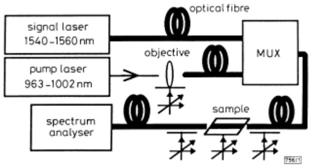
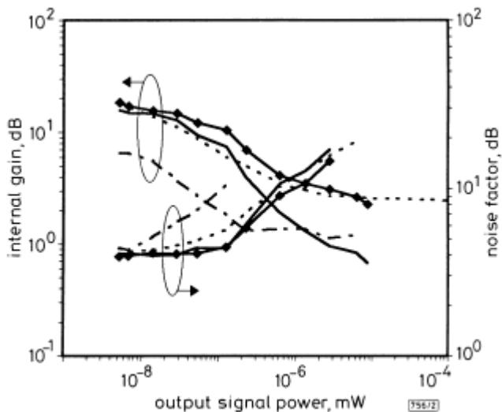
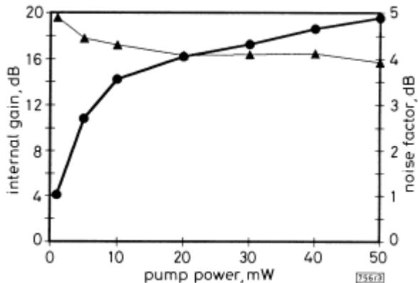

# Potassium ion-exchanged Er-Yb doped phosphate glass amplifier

P. Fournier, P. Meshkinfam, M.A. Fardad, M.P. Andrews and S.I. Najafi

Indexing terms: Ion exchange, Integrated optics, Optical waveguides

A process is developed to make potassium ion-exchanged waveguides in erbium-ytterbium co-doped phosphate glasses. The effects of pump and signal wavelengths, and of the waveguide length on the gain in the waveguides are investigated. At a signal wavelengthof 1.530µm, 19.5dB internal gain is achieved in a 6mm long waveguide; the measured noise factor is 4dB.

Introduction: Erbium-doped integrated optic waveguides have attracted significant attention in the fabrication of amplifiers for 1.55µm applications [1]. They are interesting due to their small sizes and can be integrated with other components in a single substrate. Outstanding experimental results have recently been reported on planar glass waveguide amplifiers [2, 3]. 8dB net gain at 1.534µm signal wavelength was achieved in a 4.5cm erbium-ytterbium co-doped silver ion-exchanged phosphate glass waveguide pumped at 983nm (pump power = 85mW) [2]. 4.5dB net gain $( \lambda = 1 . 5 3 6 \mu \mathrm { m } )$ was demonstrated in a 6cm sputtering deposited erbium-doped waveguide (pump power = 80mW) [3]. In our present work, we have used a potassium ion exchange process to fabricate waveguides in an erbium-ytterbium co-doped phosphate glass. In doing this, we rely on the energy transfer properties (sensitisation) between $\mathrm { Y b ^ { 3 + } }$ and $\mathrm { E r ^ { 3 + } }$ . Phosphate glasses were selected because they are known to be suitable hosts for rare-earth elements in terms of spectroscopic char acteristics required for photonic applications [1]. In addition, the sensitisation quantum efficiency is close to unity in these glasses [1]. Potassium ion exchange results in lowloss waveguides in the silicate glasses [4]. However, potassium ion exchange has not been used to make waveguides in phosphate glasses because the moisture usually present in the $\mathrm { K N O _ { 3 } }$ molten salt significantly damages the substrate surface and renders the waveguides useless for integrated optics applications. We have developed a technique to produce potassium ion-exchanged waveguides with low propagation losses in Er-Ybdoped phosphate glasses.

  
Fig. 1 Schematic diagram of gain and noise factor measurements setup

Fabrication: A commercially available erbium-ytterbium co-doped phosphate glass with the following characteristics was used to make the waveguides: $\mathrm { E r } _ { 2 } \mathrm { O } _ { 3 }$ concentration = 1.65wt%, $\mathrm { Y b } _ { 2 } \mathrm { O } _ { 3 }$ concentration $1 = 2 2 \mathrm { w t \% } ,$ refractive index at $1 . 5 3 5 \mu \mathrm { m } = 1 . 5 2 1$ , transformation temperatur $\begin{array} { r } { \mathsf { a } = 4 5 0 ^ { \circ } \mathrm { C } , } \end{array}$ , deformation temperature $= 4 8 5 ^ { \circ } \mathrm { C }$ , absorption at signal wavelength = 0.7dB/mm, peak at 1.530µm and absorption at pump wavelength = 6dB/mm, peak at $0 . 9 7 4 \mu \mathrm { m }$ . Potassium ion exchange through 5µm openings in an aluminum mask was used to produce channel waveguides in the glass sample. Ion exchange was carried out at $4 0 0 ^ { \circ } \mathrm { C }$ for 5h in a pure potassium nitrate molten salt. Prior to ion exchange, the moisture in the $\mathrm { K N O _ { 3 } }$ salt was removed in order to prevent damage to the surface of the sample. The salt was placed in a furnace, at $2 8 0 ^ { \circ } \mathrm { C }$ under moderate vacuum for 24h. Then, the temperature was increased to $4 0 0 ^ { \circ } \mathrm { C }$ to melt the salt. The system remained in vacuum for 1h, and afterwards a slow flow of Ar-gas was introduced in the furnace. There was no damage on the surface of the fabricated samples. Finally, the aluminium mask was removed from the surface of the sample and the two ends of the waveguides were polished.

Characterisation: Loss measurements [4] were performed at 1.3µm to avoid absorption due to erbium. The propagation losses were 0.2dB/cm. The coupling loss between the waveguides and singlemode fibre was 4.4dB.

The setup for gain and noise factor determination is shown in Fig. 1. A tunable Er-doped fibre laser and a tunable diode laser provided signal and pump, respectively. The input and output fibres were both singlemoded at 1.55µm wavelength. The signal light intensities from the output of the channel waveguide without and with pump light were measured by the spectrum analyser and the internal gain (= signal light power with pump/signal light power without pump) were calculated. First, a 1cm long waveguide was used and the internal gain measurement was repeated for different signal and pump wavelengths. Constant pump (25mW) and signal (65pW) powers were used. These values correspond to the guided light in the input fibre. The maximum internal gain was obtained at 1.000µm pump wavelength. The optimum pump wavelength is different from the maximum absorption wavelength $( \lambda = 0 . 9 7 4 \mu \mathrm { m } )$ due to high ytterbium concentration. This result agrees with the theoretical prediction [5]. Maximum internal gain was observed at 1.530µm signal wavelength which corresponds to the amplified spontaneous emission (ASE) peak of the waveguide.

Four waveguides with lengths L = 5, 6, 7, and 8 mm were used to study the effect of waveguide length on internal gain. The noise factor NF was also determined for these waveguides. NF is given by [6]:

$$
N F \simeq 2 n _ {s p} = P _ {A S E} / (h \nu \Delta \nu G)\tag{1}
$$

$P _ { A S E }$ is the ASE power, $\pmb { \mathit { \Pi } } _ { \pmb { \mathit { 1 0 } } _ { S P } }$ is the spontaneous emission factor, G is the internal gain, and ∆ν is the ASE linewidth. Fig. 2 summarises the results of internal gain and noise factor measurements for different lengths. The output signal power is the power measured by the spectrum analyser. The pump power was maintained at 50mW (measured at the end of the input fibre). The variation of the internal gain and noise factor with the output signal power is as expected, both becoming constant in the small signal regime. At this regime, the gain is maximum, but the noise factor is minimum as predicted by eqn. 1. The highest internal gain is obtained for the 6mm long waveguide.

  
Fig. 2 Variations of internal gain and noise factor with output signal power

The 6mm long waveguide was used to study the effect of pump power on internal gain and noise factor at 1.530µm signal 1.000µm pump wavelength. The results are illustrated in $\mathrm { F i g . 3 . }$ . The net gain was calculated, using internal gain and loss measurement results, i.e.

$$
\begin{array}{r l} \text {net gain} & = \text {internal gain} - \text {absorption} \\ & \quad - 2 \times \text {coupling loss} - \text {propagation losses} \end{array}
$$

For the 6 mm long waveguide pumped at 1.000µm and 50mW, we obtain:

$$
\mathrm{net gain} = 1 9. 5 - 4. 2 - 8. 8 - 0. 1 2 = 6. 4 8 \mathrm{dB}
$$

The net gain was also determined directly by measuring the signa power at the end of input fibre and comparing it to the signal coupled to the output fibre. For 4.8nW signal and 50mW pump power, a net gain of 7.3dB was measured.

  
Fig. 3 Internal gain and noise factor against pump power for waveguide with optimum length 6mm

● internal gain ▲ noise factor

Conclusion: The waveguides made by potassium ion exchange in Er-Yb phosphate glass demonstrated significant gain. 19.5dB internal gain with a low noise factor of 4dB in a 6mm long waveguide was achieved for signal and pump wavelengths 1.530µm and 1.000µm, respectively. High net gain of 7.3dB was achieved in a 6mm waveguide using a low pump power of 50mW (only 18mW injected in the waveguide). By reducing waveguide-fibre coupling loss (for instance by burying the waveguide or depositing a cover layer on the sample) the pump power can decrease significantly and the net gain can increase considerably.

Acknowledgment: This work was funded in part by research grants from Natural Sciences and Engineering Research Council of Canada.

## © IEE 1997

19 December 1996

Electronics Letters Online No: 19970234

P. Fournier, P. Meshkinfam and S.I. Najafi (Photonics Research Group, Ecole Polytecnique, Montreal, Quebec, H3C 3A7, Canada)

M.A. Fardad and M.P. Andrews (Chemistry Department, McGill University, Montreal, Quebec, H3A 2K6, Canada)

## References

1 NAJAFI, S.I.: ‘Overview of rare-earth-loped planar waveguides and devices’. Conf. on Rare-Earth-Doped Devices. SPIE Proc., San Jose, February 1997, Vol. 2996

2 DELAVAUX, J.-M.P., GRANLUND, S., MIZUHARA, O., TZENG, L.D., BARBIER, D., RATTAY, M., SAINT-ANDRE, F., and KEVORKIAN, A.: ‘Integrated optics erbium ytterbium amplifier system in 10Gb/s fiber transmission experiment’. ECOC’96, Oslo, Norway, 1996

3 GHOSH, R.N., SHMULOVICH, J., KANE, C.F., DE BARROS, M.R.X., NYKOLAK, G., BRUCE, A.J., and BECKER, P.C.: ‘8-mW threshold Er3+- doped planar waveguide amplifier’, IEEE Photonics Technol. Lett., 1996, 8, (4), pp. 518–520

4 NAJAFI, S.I.: ‘Introduction to glass integrated optics’ (Artech House, Boston, 1992)

5 LESTER, C., BJARKLEV, A., RASMUSSEN, T., and DINESEN, P.G.: ‘Modeling of Yb3+-sensitized Er3+-doped silica wavegnide amplifiers’, J. Lightwave Technol., 1995, 13, (5), pp. 740–743

6 SIMON, J.C., DOUSSIÈRE, P., POPHILLAT, L., and FERNIER, B.: ‘Gain and noise characteristics of a 1.5 µm near-traveling-wave semiconductor laser amplifier’, Electron. Lett., 1989, 25, (7), pp. 434–436