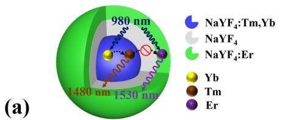
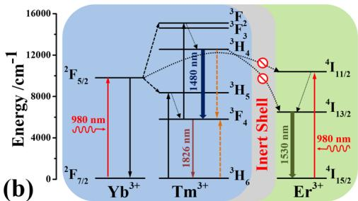
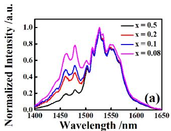
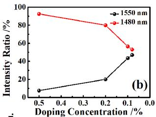
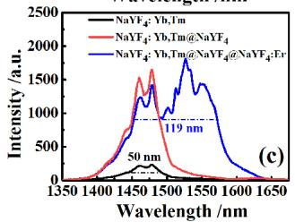
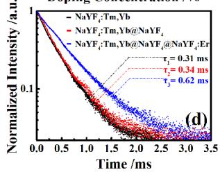
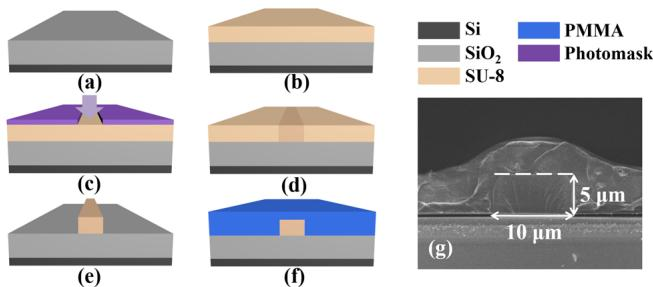
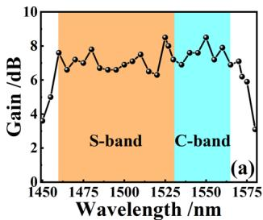
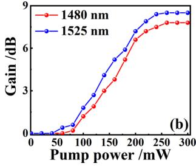

Optics Letters

# (S + C)-band polymer waveguide amplifier based on ${ \mathsf { T } } { \mathsf { m } } ^ { 3 + }$ and $\mathsf { E r } ^ { 3 + }$ layer-doped core-shell nanoparticles

Yuewu Fu,1 Tonghe Sun,1 Jun Li,1 Ying Tang,1 Yu Yang,1 Siliang Tao,1 Fei Wang,1 Daming Zhang,1 Guanshi Qin,1 Zhixu Jia,1 Dan Zhao,1,2,† AND Weiping Qin1,∗,†

1State Key Laboratory ofIntegrated Optoelectronics, College ofElectronic Science and Engineering, Jilin University, Changchun 130012, China 2e-mail: dzhao@jlu.edu.cn

\*Corresponding author: wpqin@jlu.edu.cn

†These authors contributed equally to this Letter.

Received 6 October 2022; revised 16 November 2022; accepted 4 December 2022; posted 5 December 2022; published 5 January 2023

Optical waveguide amplifiers are essential devices in integrated optical systems. Their gain bandwidths directly determine the operating wavelength of optical circuits. Due to the dificulty of developing wideband gain media, it has been a challenge to fabricate devices with broadband amplification capability, resulting in few reports on multi-band polymer waveguide amplifiers. Here, a polymer waveguide amplifier is demonstrated, which achieves loss compensation covering the whole (S + C) band by using $\mathbf { N a } \mathbf { Y } \mathbf { F } _ { 4 } { \mathrm { : T m } } , \mathbf { Y b } @ \mathbf { N a } \mathbf { Y } \mathbf { F } _ { 4 } @ \mathbf { N a } \mathbf { Y } \mathbf { F } _ { 4 } { \mathrm { : E r } }$ nanoparticles (NPs)- doped SU-8 as the gain medium. The NPs with a layer-doped core-multishell structure not only provided two emitters required for (S + C)-band amplification, but also reduced the energy transfer (ET) between them. Under 980-nm excitation, the full width at half maximum (FWHM) of the emission peak of NPs reached 119 nm, and the relative gain in the (S + C) band was about 6–8 dB, successfully expanding the operating wavelength from single-band to multi-band. © 2023 Optica Publishing Group

https://doi.org/10.1364/OL.477267

With the increase of worldwide information terminals and the development of fifth-generation mobile communications, the capacity load requirements of optical communication systems keep rising rapidly, thereby forcing people to strive to improve the capacity of optical communication networks. The wavelength division multiplexing (WDM) system has served to solve this capacity crisis for years [1,2]. However, the available working wavelength of WDM is directly determined by the gain bandwidth of optical amplifiers [3,4]. There are several low-loss transmission windows in conventional single-mode fiber communication. Still, only the C band has been exploited due to the outstanding performance of erbium-doped fiber amplifiers (EDFAs) [5]. In this case, the bandwidth of optical amplifiers needs to be expanded to drive the development of future optical networks [6–9]. Integrated optical circuits are essential parts of optical networks [10,11], and waveguide amplifiers are specially developed to compensate for the losses generated in them [12–16]. Up to now, research on waveguide amplifiers has mainly focused on a single band, such as the C band or S band [17,18]. If the gain bandwidth can be expanded to multi-band, the working eficiency of WDM will be significantly improved. Doping rare-earth (RE) ions is a widely accepted method for fabricating waveguide amplifiers. The ${ } ^ { 3 } \mathrm { H } _ { 4 } \mathrm {  } ^ { 3 } \mathrm { F } _ { 4 }$ transition of thulium (Tm3+) ions and $\mathrm { { } ^ { 4 } I _ { 1 3 / 2 } { \stackrel { - } { \to } } { } ^ { 4 } I _ { 1 5 / 2 } }$ transition of erbium $( \mathrm { E r } ^ { 3 + } )$ ions are located at 1.48 µm and 1.53 µm, respectively, which coincide well with the S and C bands [19,20]. Theoretically, an (S + C)-band waveguide amplifier can be realized by codoping $\mathrm { T m } ^ { 3 + }$ and $\mathrm { E r } ^ { 3 + }$ together. However, the energy transfer (ET) between Tm3+ and Er3+ will weaken the emission at 1.48 µm and enhance the emission at 1.53 µm, ultimately reducing the gain performance of the S band [21,22]. Therefore, a method to reduce the ET between diferent ions needs to be explored. Only in this way can the gain performance of a waveguide amplifier operating in the S and C bands be balanced. However, there has been no report on (S + C)-band amplification in polymer waveguide amplifiers.

In this Letter, we report an (S + C)-broadband amplifier. By inserting an inert shell, we constructed core-shell structured nanoparticles (NPs) that separated the doped $\mathrm { T m } ^ { 3 + }$ and $\mathrm { E r } ^ { 3 + }$ ions, thereby reducing the harmful ET and balancing the emissions in the S and C bands. A polymer/silica hybrid waveguide amplifier was fabricated with the $\mathrm { T m } ^ { 3 + }$ and $\dot { \mathrm { E r } } ^ { 3 + }$ layer-doped NPs. The design strategy can provide loss compensation in the (S + C) band. Firstly, NaYF :Tm,Yb@NaYF @NaYF :Er NPs were synthesized to meet the multi-band gain requirements of waveguide amplifiers. Under the excitation of a 980-nm pump laser, the full width at half maximum (FWHM) of downconversion (DC) emission peak around 1.5 µm reached about 119 nm. Then the NPs were dispersed uniformly into polymer photoresist SU-8 to synthesize the gain medium, and a rectangular waveguide amplifier was prepared using this gain medium as the core material. The relative gain in the range of 1460–1565 nm was about 6–8 dB, successfully covering the whole $( \mathsf { S } + \mathsf { C } )$ band. To the best of our knowledge, this is the first time that (S + C)-band amplification has been obtained in a polymer waveguide amplifier device. It demonstrates a new strategy for the design and fabrication of broadband waveguide amplifiers and furthermore provides guidance for subsequent research.

In our experiment, the NPs were expected to achieve emission in the (S + C) band by doping both $\dot { \mathrm { T m } } ^ { 3 + }$ and $\mathrm { E r } ^ { 3 + }$ ions. Under

  
Fig. 1. (a) Structure diagram of core-multishell NPs and (b) energy level diagrams of $\mathrm { T m } ^ { 3 + } , \mathrm { Y b } ^ { 3 + }$ , and $\mathrm { E r } ^ { 3 + }$ ions, and possible downconversion processes under 980-nm laser excitation.

980-nm excitation, the emissions from the ${ } ^ { 3 } \mathrm { H } _ { 4 } \mathrm {  } { } ^ { 3 } \mathrm { F } _ { 4 }$ transition (1.48 µm) of $\mathrm { T m } ^ { 3 + }$ and the $^ 4 \mathrm { I } _ { 1 3 / 2 } \mathrm { \longrightarrow } ^ { 4 } \mathrm { I } _ { 1 5 / 2 }$ transition (1.53 µm) of $\mathrm { E r } ^ { 3 + }$ correspond to the S band and C band, respectively. However, the ET process of $^ { 3 } \mathrm { H } _ { 4 } { \longrightarrow } ^ { 3 } \mathrm { F } _ { 4 } ~ ( \mathrm { T } \mathrm { m } ^ { 3 + } ) : ^ { 4 } \mathrm { I } _ { 1 5 / 2 } { \longrightarrow } ^ { 4 } \mathrm { I } _ { 1 3 / 2 } ~ ( \mathrm { E r } ^ { 3 + } )$ may reduce the emission at 1.48 µm. To obtain a relatively flat emission in the $( \mathsf { S } + \mathsf { C } )$ band, avoiding or weakening the efects of this ET is necessary. Although it is dificult to eliminate this unfavorable ET, increasing the distance between $\mathrm { T m } ^ { 3 + }$ and $\mathrm { E r } ^ { 3 + }$ ions can efectively reduce the probability of ET occurrence. Therefore, the NPs in this experiment were designed as a core-multishell structure to isolate these two ions [ Fig. 1(a)]. Firstly, NaYF :Tm,Yb cores were synthesized, and their emission located in the S band under 980-nm excitation. Then the cores were coated with an inert $\mathrm { N a Y F _ { 4 } }$ shell to compensate for the surface defects, thereby significantly enhancing the 1.48-µm emission. Finally, an NaYF :Er shell was grown as the outermost layer to provide emission peaked at 1.53 µm. Apart from enhancing the emission in the S band, the inert shell would reduce the ET between $\mathrm { T m } ^ { 3 + }$ and $\mathrm { E r } ^ { 3 + }$ ions by increasing the distance between the cores and outermost shells.

To further illustrate the emission mechanism in the NPs, possible DC processes are indicated in the energy level diagrams of $\mathrm { T m ^ { 3 + } , \bar { Y } b ^ { 3 + } }$ , and $\mathrm { E r } ^ { 3 + }$ ions [Fig. 1(b)]. Under 980-nm excitation, ${ \mathrm { Y } } { \mathsf { b } } ^ { 3 + }$ ions in the cores absorb pumping photons and transfer energy to $\mathrm { T m } ^ { 3 + }$ ions through ET processes o ${ } ^ { : 2 } \mathrm { F } _ { 5 / 2 } {  } ^ { 2 } \mathrm { F } _ { 7 / 2 } ( \mathrm { Y } \mathrm { b } ^ { 3 + } )$ $: { } ^ { 3 } \mathrm { H } _ { 6 } { \longrightarrow } ^ { 3 } \mathrm { H } _ { 5 } ~ ( \mathrm { T } \mathrm { m } ^ { 3 + } )$ and ${ } ^ { 2 } \mathrm { F } _ { 5 / 2 } { \longrightarrow } ^ { 2 } \mathrm { F } _ { 7 / 2 } \ ( \mathrm { Y } \mathrm { b } ^ { 3 + } ) : { } ^ { 3 } \mathrm { F } _ { 4 } { \longrightarrow } ^ { 3 } \mathrm { F } _ { 2 }$ (Tm3+). Then the 1.48-µm emission originates from the ${ ^ 3 { \mathrm { H } } _ { 4 } } \mathrm {  } { ^ 3 { \mathrm { F } } _ { 4 } }$ transition of $\mathrm { T m } ^ { 3 + }$ ions. In the outermost shell, pumping photons are absorbed by $\mathrm { E r } ^ { 3 + }$ ions to populate the $^ 4 \mathrm { I } _ { 1 1 / 2 }$ level from the $^ 4 \mathrm { I } _ { 1 5 / 2 }$ level, then the excited $\mathrm { E r } ^ { 3 + }$ ions nonradiatively relax to the $^ 4 \mathrm { I } _ { 1 3 / 2 }$ level and emit 1.53-µm emission through the transition of $^ 4 \mathrm { I } _ { 1 3 / 2 }$ ${  } ^ { 4 } \mathrm { I } _ { 1 5 / 2 } .$ . It is worth noting that the inert shell increased the distance between the $\mathrm { T m } ^ { 3 + }$ and $\mathrm { E r } ^ { 3 + }$ ions, reducing the unfavorable efect on 1.48-µm emission.

The NPs were synthesized via a high-temperature decomposition method. Detailed steps for the synthesis are shown in Supplement 1. The morphologies of NPs at various growth stages were characterized using transmission electron microscopy (TEM), as shown in Figs. S1(a)–S1(c) in Supplement 1, and the particle size distribution histograms were plotted as inserts. The $\mathrm { N a Y F _ { 4 } } \mathrm { . }$ Tm,Yb cores had relatively small sizes with a mean diameter of 11 nm [Fig. S1(a) and inset image in Supplement 1]. The average size of NPs was increased to 19 nm after coating [Fig. S1(b) and inset image in Supplement 1], and the thickness of inert shells was calculated as about 4 nm. Coating NaYF :Er shells further increased the average size of NPs to 22 nm [Fig. S1(c) and inset image in Supplement 1]. The particle size of the NPs increased with the coating process while maintaining uniform size and spherical morphology. The uniform size, spherical shape, and greatly reduced specific surface area are beneficial to reduce the scattering loss and improve the optical performance of the waveguide amplifier. The crystalline phases of three NPs were characterized by x ray Difraction (XRD), as shown in Fig. S1(d) in Supplement 1. The positions and relative intensities of difraction peaks of the NPs are in good agreement with those of standard $\mathrm { \beta - N a Y F _ { 4 } }$ crystal $\mathrm { ( \beta \mathrm { - N a Y F _ { 4 } } }$ : JCPDS file number 16- 0334), which indicates that the three groups of NPs are of pure hexagonal phase.

In order to flatten the emission in the S and C bands, we repeatedly adjusted the doping concentration of $\mathrm { T m } ^ { 3 + }$ and $\mathrm { E r } ^ { 3 + }$ ions. Under the same doping concentration, the 1.53-µm emission of $\mathrm { E r } ^ { 3 + }$ was significantly stronger than the 1.48-µm emission of $\mathrm { T m } ^ { 3 + }$ . In this case, we doped ${ \mathrm { Y } } { \mathsf { b } } ^ { 3 + }$ ions only in cores as the sensitizers for exciting $\mathrm { T m } ^ { 3 + }$ ions. This functional design allowed most pump photons to be absorbed by $\mathrm { N a Y F _ { 4 } { : } T m , Y b }$ cores, thus enhancing the emission at 1.48 µm. In our previous work, the strongest 1.48-µm emission was obtained when doping concentrations of $\mathrm { T m } ^ { 3 + }$ and ${ \mathrm { Y } } { \mathsf { b } } ^ { 3 + }$ ions were 1% and 20%, respectively [18]. Therefore, the $\mathrm { N a Y F _ { 4 } } \mathrm { : } 1 \% \mathrm { T m }$ , 20%Yb NPs were chosen as the cores. Then a series of core-multishell NPs with diferent $\mathrm { E r } ^ { 3 + }$ doping concentrations were synthesized to obtain the flat emission in the S and C bands, and their DC emission spectra were recorded in Fig. 2(a). Figure 2(b) shows the integrated intensity ratio of 1.48-µm and 1.53-µm emissions with diferent $\mathrm { E r } ^ { 3 + }$ doping concentrations. The ratio approached 50% as the $\mathrm { E r } ^ { 3 + }$ concentration decreased from 0.5% to 0.08%. Finally, the doping concentration of $\mathrm { E r } ^ { 3 + }$ ions was determined to be 0.08%, which ensured the amplification flatness of the waveguide amplifier.

Figure 2(c) plots the DC emission spectra of the three NPs under the same test conditions (pump power, slit width, sample position, etc.). The inert shell efectively reduced the surface quenching of the $\mathrm { N a Y F _ { 4 } { : } T m , Y b }$ cores and resulted in a significant increase of 1.48-µm emission. The enhanced 1.48-µm emission allowed us to increase the relative doping concentration of $\mathrm { E r } ^ { 3 + }$ ions, which improved the gain performance in the C band. After the coating process, the FWHM of the emission peak increased from 50 nm $( \mathrm { N a Y F _ { 4 } ; T m , Y b } )$ to 119 nm $( \mathrm { N a Y F _ { 4 } } \mathrm { { : } T m , Y b @ N a Y F _ { 4 } } @ \mathrm { N a Y F _ { 4 } } \mathrm { { : } E r ) . }$ , achieving (S + C)-band coverage. Since the outermost shell was doped with $\mathrm { E r } ^ { 3 + }$ ions, coating it inevitably attenuated the 1.48-µm emission of $\mathrm { T m } ^ { 3 + }$ ions slightly. $\mathrm { E r } ^ { 3 + }$ ions can absorb photons of 0.98 µm and 1.48 µm: the former will relatively reduce the absorption of pump photons by ${ \mathrm { Y } } { \mathsf { b } } ^ { 3 + }$ ions in the core, while the latter will directly weaken the emission intensity at $1 . 4 8 \mu \mathrm { m }$ . Apart from that, the ET between $\mathrm { T m } ^ { 3 + }$ and $\mathrm { E r } ^ { 3 + }$ ions cannot be eliminated entirely, which may also be the reason for the weakening of emission intensity at 1.48 µm.

  
Fig. 2. NaYF4:Tm,Yb@NaYF4@NaYF4:x%Er NPs: (a) emission spectra and (b) intensity ratios of 1.48-µm and 1.53-µm emissions; $\mathrm { N a Y F _ { 4 } { : } T m , Y b @ N a Y F _ { 4 } @ N a Y F _ { 4 } { : } 0 . 0 8 ^ { \circ } / \mathrm { o E r } { : } }$ (c) emission spectra and (d) decay curves of 1480-nm fluorescence from the $^ { 3 } \mathrm { { H } _ { 4 } }$ level in diferent growth stages.

To prove that the ET from $\mathrm { T m } ^ { 3 + }$ to $\mathrm { E r } ^ { 3 + }$ ions was reduced by the inert shell, the lifetimes of the $^ 3 \mathrm { H } _ { 4 }$ level of $\mathrm { T m } ^ { 3 + }$ in the three NPs were measured and fitted with a single-exponential function as

$$
I (t) = I _ {0} \exp (- t / \tau),\tag{1}
$$

where $I _ { 0 }$ is an intensity parameter at $t = 0$ and τ is the excited state lifetime. Theoretically, if the inert shell successfully reduces the ET between $\mathrm { T m } ^ { 3 + }$ and $\mathrm { E r } ^ { 3 + }$ ions, the lifetime of the $^ 3 \mathrm { H } _ { 4 }$ level $( \mathrm { T m } ^ { 3 + } )$ will not decrease after coating the $\mathrm { N a Y F _ { 4 } } \mathrm { . }$ Er shell. As shown in Fig. 2(d), the lifetime of the $^ 3 \mathrm { H } _ { 4 }$ level $\left( \mathrm { T m } ^ { 3 + } \right)$ first increased from 0.31 ms to 0.34 ms by coating the inert shell. After coating the outermost $\mathrm { N a Y F _ { 4 } } .$ :Er shell, the lifetime of the $^ 3 \mathrm { H } _ { 4 }$ level $\left( \mathrm { T m } ^ { 3 + } \right)$ ) did not decrease, indicating that the inert shell indeed reduced the ET between $\mathrm { T m } ^ { 3 + }$ and $\mathrm { E r } ^ { 3 + }$ ions. In addition, the further increased lifetime of 0.62 ms was attributed to the decreasing of surface defects by the outermost shell. Our designed core-multishell NPs successfully meet design expectations and are ready for fabricating the polymer Tm, Er co-doped waveguide amplifier (TECDWA).

In this experiment, NaYF :Tm,Yb@NaYF @NaYF :Er NPs were used to synthesize the gain medium of the polymer waveguide amplifier, and the photoresist SU-8 was selected as the core material. Since the NPs could not be directly dispersed in SU-8, the NPs were first dispersed in toluene and then mixed with SU-8. The mixture was sonicated for 120 min to obtain the gain medium. Using the NPs-doped photoresist SU-8 as the gain medium, we fabricated a rectangular waveguide by traditional semiconductor lithography, as shown in Figs. $3 ( \mathrm { a } ) { - } 3 ( \mathrm { f } )$ . Silica $\displaystyle ( \mathrm { S i O } _ { 2 } )$ was used as the bottom cladding ofthe waveguide because of its low-loss transmission and easy integration with other optical devices. The NPs-doped SU-8 was spin-coated on the surface of SiO at 3000 R/min to form a film with a thickness of 5 µm.

  
Fig. 3. (a)–(f) Preparation process of the TECDWA and (g) SEM image of the waveguide.

Then the core film was covered with a patterned photomask and the rectangular waveguide was obtained by photolithography. Finally, the polymethyl methacrylate (PMMA) was spin-coated on the surface of the waveguide to form the upper cladding. The Scanning Electron Microscope (SEM) image shows the waveguide cross section, and the width and thickness of the core layer are 10 µm and 5 µm, respectively. The details of the fabrication process are described in Supplement 1.

To further explore the optical power confinement capability of the waveguide, we simulated the optical power distribution using COMSOL. The simulation results of the rectangular waveguide cross section at wavelengths of 980 nm, 1480 nm, and 1530 nm are shown in Supplement 1 Figs. S2(a), S2(b), and S2(c), respectively. By calculating the surface integral, the overlapping integral factors of the waveguide for the wavelengths of 980 nm, 1480 nm, and 1530 nm were 99.6%, 98.7%, and 98.6%, respectively. Therefore, it can be considered that both the signal and pump lights are well confined in the waveguide core, which benefits the amplification eficiency of the polymer waveguide amplifier.

A test system was built to characterize the gain performance of the TECDWA, as shown in Fig. S3 in Supplement 1. It consisted of signal and pump lasers, an optical coupler, an optical power meter (Thorlabs: PM100D), and an optical spectrometer analyzer (OSA: ANDO AQ-6315 A). The S-band tunable laser (EXFO: T100S-HP) and C-band tunable laser (Santec: TSL-550) were used to provide signal lights, and the 980-nm laser diode (BWT: DS3-51512-LDNo.) was used as the pump source. Through the coupling system, signal and pump lights were combined by WDM and entered the input port of the TECDWA. The amplified signal light was collected at the tail of the waveguide and coupled into the power meter and OSA simultaneously by a power splitter. The insertion loss of the TECDWA and gains at diferent wavelengths were directly read out.

When 980-nm pump light entered the waveguide, a uniform bright blue upconversion (UC) luminescence could be observed on its surface [Fig. S4(a) in Supplement 1]. This indicates that the NPs have been uniformly doped into the core layer without obvious agglomeration. To further analyze the fluorescence of the waveguide amplifier, the UC emission spectrum in the visible region was recorded [Fig. S4(b)in Supplement 1]. Since ${ \mathrm { Y b } } ^ { 3 + }$ ions were doped in the cores of the NPs only, $\mathrm { T m } ^ { 3 + }$ ions in cores were more likely to obtain energy from the excited ${ \mathrm { Y } } { \mathsf { b } } ^ { 3 + }$ ions, resulting in significant UC luminescence. The bright blue luminescence observed on the surface of the waveguide came from the UC emissions peaked at 452 nm and 476 nm. In contrast, the UC luminescence of $\mathrm { E r } ^ { 3 + }$ ions was hard to observe because there were no sensitizing ions nearby.

The relative gain of the TECDWA was calculated using

$$
G = 1 0 \lg (P _ {s - o u t} ^ {P} / P _ {s - o u t}),\tag{2}
$$

where G is the relative gain of the TECDWA, and $P _ { s - o u t } ^ { p }$ and $P _ { s - o u t }$ are output powers of signal light with and without excitation, respectively. The length of the device was 1.5 cm, and the insertion loss was ∼21 dB. Figure S5 in Supplement 1 shows the absorption spectrum of the gain material. Combined with the insertion losses measured at 1300 nm and 1550 nm [Figs. S6(a) and S6(b) in Supplement 1], the coupling loss and propagation loss were calculated to be ∼7.2 dB/facet and ∼4.2 dB/cm, respectively. Gain measurement was performed every 5 nm in the $( \mathsf { S } + \mathsf { C } )$ band to characterize the broadband gain performance. When the signal power was 1 mW and the pump power was

  
Fig. 4. Relative gain of the TECDWA versus (a) signal wavelength and (b) pump power at 1480 nm and 1525 nm.

300 mW, the relative gain ofthe TECDWA reached about 6–8 dB in the (S + C) band, as shown in Fig. 4(a). To observe the relationship between gain and pump power, two wavelengths of 1480 nm and 1525 nm were selected for further measurement. As shown in Fig. 4(b), the gains of the two wavelengths both increased gradually with the pump power and tended to be flat eventually. The maximum relative gain of 8.5 dB and an internal gain of 2.2 dB [Eq. (S1) in Supplement 1] were obtained at 1525 nm when the pump power was 250 mW. In addition, under this pump power, the thermal efect would not greatly afect the optical performance of the device, and the power conversion eficiency of the device was about 1.5% [Eq. (S2) in Supplement 1]. The test results demonstrate that the fabricated TECDWA can provide relatively uniform gain covering the (S + C) band, realizing the function of an $( \mathsf { S } + \mathsf { C } )$ -band amplifier.

In conclusion, a polymer TECDWA device that can provide gain in the (S + C) band was prepared based on $\mathrm { T m } ^ { 3 + }$ and $\mathrm { E r } ^ { 3 + }$ layer-doped NPs. The NaYF :Tm,Yb@NaYF @NaYF :Er NPs were designed as a core-multishell structure to reduce the ET from $\mathrm { T m } ^ { 3 + }$ to $\mathrm { E r } ^ { 3 + }$ ions. Using NPs-doped SU-8 as the gain medium, the polymer TECDWA was fabricated. The device provided a relative gain of 6–8 dB in the range of 1460 to 1565 nm, and a maximum relative gain of 8.5 dB was obtained at 1525 nm. To the best of our knowledge, it is the first $( S + C ) \ –$ band amplification observed in a polymer waveguide amplifier, which is important for developing optical broadband amplification devices. However, the gain performance of the fabricated device can still be further improved. In this experiment, 1.48- µm emission $( \mathrm { T m } ^ { 3 + } )$ with relatively lower intensity limited the doping concentration of $\mathrm { E r } ^ { 3 + }$ ions. Theoretically, the permissive $\mathrm { E r } ^ { 3 + }$ doping concentration can increase with the enhancement of S-band emission. Therefore, improving the S-band emission is key to improving the device’s overall gain. As methods to enhance the S-band emission are applied (modifying surface defects, doping UC quencher, etc.), the gain performance of the broadband waveguide amplifier will reach a higher level. In addition, the layer-doped multishell NPs can significantly reduce the ET between RE ions in diferent layers, ensuring the stability of respective emissions and liberating the combination of diferent

RE ions. We believe that our layer-doped multishell NPs strategy can be extended into broadband amplification operating in more than the S and C bands, further promoting the bandwidth of amplifiers.

Funding. National Key Research and Development Program of China (2021YFB2800502); National Natural Science Foundation of China (61875071, 12174150, 62075082).

Disclosures. The authors declare no conflicts of interest.

Data availability. Data underlying the results presented in this paper are not publicly available at this time but may be obtained from the authors upon reasonable request.

Supplemental document. See Supplement 1 for supporting content.

## REFERENCES

1. Y. T. Wan and R. Q. Hui, J. Lightwave Technol. 25, 1390 (2007).

2. K. Honda, K. Hara, H. Nakamura, K. Sone, G. Nakagawa, Y. Hirose, T. Hoshida, and J. Terada, Opt. Express 29, 42457 (2021).

3. N. Sugimoto, Curr. Opin. Solid State Mater. Sci. 5, 471 (2001).

4. J. Clark and G. Lanzani, Nat. Photonics 4, 438 (2010).

5. H. Chen, C. Jin, B. Huang, N. K. Fontaine, R. Ryf, K. Shang, N. Gregoire, S. Morency, R. J. Essiambre, G. Li, Y. Messaddeq, and S. LaRochelle, Nat. Photonics 10, 529 (2016).

6. D. Amarasinghe, A. Ruseckas, A. E. Vasdekis, G. A. Turnbull, and I. D. W. Samuel, Adv. Mater. 21, 107 (2009).

7. Y. Ososkov, A. Khegai, S. Firstov, K. Riumkin, S. Alyshev, A. Kharakhordin, A. Lobanov, A. Guryanov, and M. Melkumov, Opt. Express 29, 44138 (2021).

8. E. M. Dianov, J. Lightwave Technol. 31, 681 (2013).

9. S. M. Yeh, S. L. Huang, Y. J. Chiu, H. Taga, P. L. Huang, Y. C. Huang, Y. K. Lu, J. P. Wu, W. L. Wang, D. M. Kong, K. Y. Huang, J. S. Wang, P. Yeh, and W. H. Cheng, J. Lightwave Technol. 30, 921 (2012).

10. Z. Chai, X. Y. Hu, F. F. Wang, X. X. Niu, J. Y. Xie, and Q. H. Gong, Adv. Opt. Mater. 5, 1600665 (2017).

11. H. Ma, A. L. Y. Jen, and L. R. Dalton, Adv. Mater. 14, 1339 (2002).

12. W. H. Wong, K. S. Chan, and E. Pun, Appl. Phys. Lett. 87, 011103 (2005).

13. Y. W. Fu, T. H. Sun, M. L. Zhang, X. C. Zhang, F. Wang, and D. M. Zhang, Chin. Phys. B 28, 104206 (2019).

14. T. H. Sun, Y. W. Fu, X. C. Zhang, J. M. Yan, F. Wang, and D. M. Zhang, Opt. Commun. 488, 126723 (2021).

15. T. H. Sun, Y. W. Fu, Z. G. Cao, S. L. Tao, J. M. Yan, D. Zhao, D. Zhang, F. Wang, and D. M. Zhang, Opt. Lett. 46, 5385 (2021).

16. Z. Zhou, J. Xue, B. Zhang, C. Wang, and D. Zhang, Appl. Phys. Lett. 118, 173301 (2021).

17. I. Cestier, S. Combrié, S. Xavier, G. Lehoucq, A. De Rossi, and G. Eisenstein, Opt. Lett. 37, 3996 (2012).

18. Y. W. Fu, Y. Yang, T. H. Sun, Y. Tang, J. Li, H. Cui, W. P. Qin, F. Wang, G. S. Qin, and D. Zhao, Opt. Lett. 47, 154 (2022).

19. G. Lakshminarayana, U. Caldiño, A. N. Meza-Rocha, A. Lira, and T. Park, Opt. Mater. 96, 109354 (2019).

20. C. Chen, D. Zhang, T. Li, D. Zhang, L. Song, and Z. Zhen, Appl. Phys. Lett. 94, 684 (2009).

21. H. Jia, D. G. Li, D. Zhang, Y. H. Dong, S. T. Ma, M. Zhou, W. H. Di, and W. P. Qin, ACS Appl. Mater. Interfaces 13, 4402 (2021).

22. E. F. Chillcce, E. Rodriguez, A. A. R. Neves, W. C. Moreira, C. L. Cesar, and L. C. Barbosa, Opt. Fiber Technol. 12, 185 (2006).